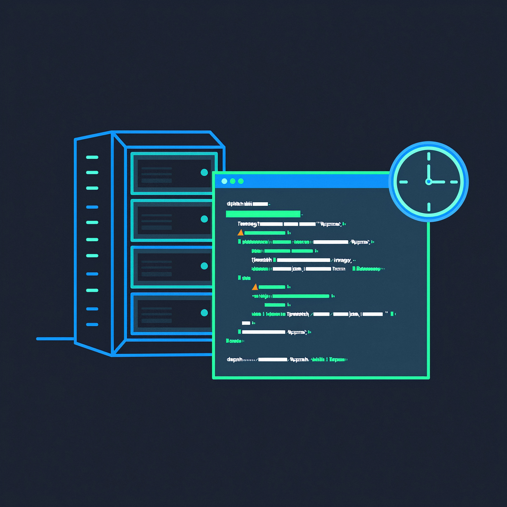

<p align="center">
    <a href="" target="_blank">
      
    </a>
</p>
<h1 align="center">Cron-Flush-Data</h1>
<p align="center"><strong>定时任务用户刷新数据库和缓存中的数据<br><em>持续更新中～</em></strong></p>
<div align="center">
    <a href="https://github.com/AlfonsoKevin/Cron-Flush-Data"></a></div>


[中文|[English](./README_English.md)]

## 介绍😎

​	假设你好不容易部署了一个项目上线~~，这个项目的本质在于**展示**，对于线上数据库的数据是满意的😁。项目中的某些特性，让你不得不考虑到，定期刷新数据。比如说某个功能具有次数的限制，而你没有接入一些账号服务，所以说，次数是你提前配置好的。但是如果使用次数达到了上限，对于后面别人的体验是很差的🥹，本身而言，也会影响展示。

​	项目提供一个定时任务，用于更新数据库的数据，当然如果配置了缓存，也提供了刷新缓存的配置。

> 先决条件：
>
> 1.Linux环境
>
> 2.用于展示项目
>
> 3.Docker中部署的MySQL和Redis
>
> 4.确保 Docker 容器在 Cron 执行时处于运行状态。

## 项目目录📇

```txt
├─📄 cron_tab.md                   # 定时任务说明
├─📄 log_change.md                 # 日志轮换
├─📄 README.md
├─📄 README_English.md
└─📁 shell                         # Shell脚本
  ├─📄 import_sql.sh               # SQL
  └─📄 import_sql_redis.sh         # SQL和Redis的
```


## 食用指南🧭

使用MySQL的SQL文件，进行数据的导入，来达到数据同步，并且结合Redis来清空缓存。每一个数据库对应一个文件，如果有多个数据库对应多个文件。

整个流程如下：

1.创建定时任务文件夹，赋予权限；添加SQL文件到文件夹中，一个文件对应一个数据库

2.导入脚本（项目中shell文件），修改配置（MySQL容器名称，配置sql文件路径，密码，账户，redis 的相关配置..）

3.直接使用脚本进行测试 `./import_sql.sh`

4.查看运行结果/日志

5.[使用cron表达式定期执行🤖](./cron_tab.md)

6.[日志轮换⭐](./log_change.md)


提供了两个版本

### 版本一：

定时任务刷新数据库的数据，多个数据库（可以调整数组中的元素个数），没有缓存。

`import_sql.sh`

```sh
#!/bin/bash

# Docker 容器和数据库配置
DOCKER_CONTAINER="your_mysql_container_name"  # Docker 容器名称
DB_USER="your_db_user"                        # 数据库用户名
DB_PASSWORD="your_db_password"                # 数据库密码

# 定义三个数据库及其对应的 SQL 文件路径
declare -A DATABASES=(
  ["database1"]="/path/to/database1.sql"     # 数据库1名称和对应的SQL文件
  ["database2"]="/path/to/database2.sql"     # 数据库2名称和对应的SQL文件
  ["database3"]="/path/to/database3.sql"     # 数据库3名称和对应的SQL文件
)

# 遍历所有数据库并执行对应的 SQL 文件
for db_name in "${!DATABASES[@]}"; do
  sql_file="${DATABASES[$db_name]}"
  echo "正在同步数据库 [$db_name]，使用文件: $sql_file"

  # 检查 SQL 文件是否存在
  if [ ! -f "$sql_file" ]; then
    echo "错误: SQL 文件 $sql_file 不存在！"
    continue  # 跳过当前循环，继续下一个数据库
  fi

  # 执行导入命令
  docker exec -i $DOCKER_CONTAINER mysql -u$DB_USER -p$DB_PASSWORD $db_name < $sql_file

  # 检查执行结果
  if [ $? -eq 0 ]; then
    echo "[$db_name] 同步成功"
  else
    echo "[$db_name] 同步失败！"
  fi
done
```


### 版本二：

**引入Redis，使用了[延时双删](#注意事项👌)的策略，先删除缓存，更新数据库，然后延时删除缓存。**在多数据库同步基础上多了刷新缓存。

`import_sql_redis.sh`

```sh
#!/bin/bash

# --------------------------
# Docker 容器配置
# --------------------------
DOCKER_MYSQL="your_mysql_container"    # MySQL 容器名称
DOCKER_REDIS="your_redis_container"    # Redis 容器名称

# --------------------------
# MySQL 数据库配置
# --------------------------
DB_USER="your_db_user"
DB_PASSWORD="your_db_password"
declare -A DATABASES=(
  ["database1"]="/path/to/database1.sql"
  ["database2"]="/path/to/database2.sql"
  ["database3"]="/path/to/database3.sql"
)

# --------------------------
# 延时双删参数
# --------------------------
DELAY_SECONDS=5  # 等待时间（秒），根据业务需求调整

# --------------------------
# 主逻辑
# --------------------------
error_flag=0  # 全局错误标记

# 步骤 1: 第一次清理 Redis 缓存
echo "[1/4] 第一次清理 Redis 缓存..."
docker exec $DOCKER_REDIS redis-cli flushall >/dev/null 2>&1
if [ $? -eq 0 ]; then
  echo "第一次清理成功"
else
  echo "第一次清理失败！"
  error_flag=1  # 可选项：如果第一次清理失败直接终止任务，移除此行则不终止
fi

# 步骤 2: 同步 MySQL 数据库
echo "[2/4] 开始同步数据库..."
for db_name in "${!DATABASES[@]}"; do
  sql_file="${DATABASES[$db_name]}"
  if [ ! -f "$sql_file" ]; then
    echo "错误: SQL 文件 $sql_file 不存在！"
    error_flag=1
    continue
  fi

  docker exec -i $DOCKER_MYSQL mysql -u$DB_USER -p$DB_PASSWORD $db_name < "$sql_file"
  if [ $? -ne 0 ]; then
    echo "[$db_name] 同步失败！"
    error_flag=1
  else
    echo "[$db_name] 同步成功"
  fi
done

# 步骤 3-4: 仅当数据库同步成功时执行第二次清理
if [ $error_flag -eq 0 ]; then
  echo "[3/4] 等待 ${DELAY_SECONDS} 秒..."
  sleep $DELAY_SECONDS

  echo "[4/4] 执行第二次 Redis 缓存清理..."
  docker exec $DOCKER_REDIS redis-cli flushall >/dev/null 2>&1
  if [ $? -eq 0 ]; then
    echo "第二次清理成功"
  else
    echo "第二次清理失败！"
  fi
else
  echo "[3/4] 数据库同步失败，跳过第二次缓存清理"
fi
```


## 注意事项👌

使用的是`延时双删`的策略，**这个策略无法保证双写的强一致性，在于延时的时间不确定，这里请自行查阅数据库和缓存的双写一致性问题，用于展示项目还是可以的。可以根据经验手动调整**。

------

感谢您对该项目的关注和支持！🕵️‍♀️


