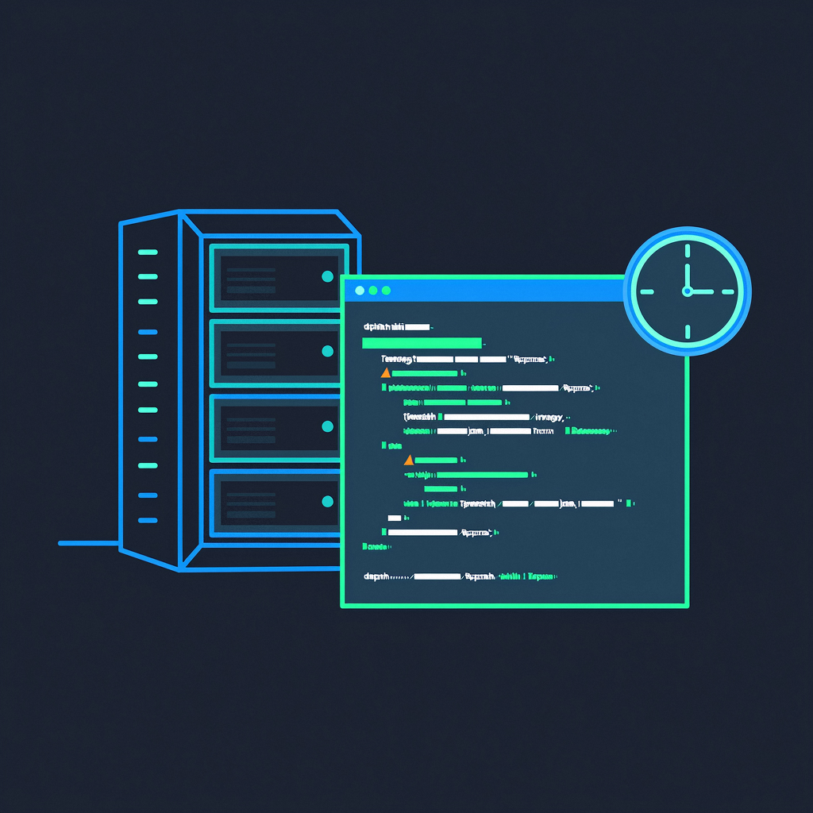

<p align="center">
    <a href="" target="_blank">
      
    </a>
</p>
<h1 align="center">Cron-Flush-Data</h1>
<p align="center"><strong>Scheduled task: Users refresh data in the database and cache<br><em>Continuously updating～</em></strong></p>
<div align="center">
    <a href=""></a></div>


[中文|English]

## Introduction😎

​	Assuming that you have difficulty deploying a project online, the essence of this project is to showcase and be satisfied with the data in the online database 😁。 Some features in the project require you to consider regularly refreshing the data. For example, a certain feature has a limit on the number of times it can be accessed, but you haven't connected to any account services, so the number of times is pre configured by you. But if the usage limit is reached, it will have a very poor experience for others later on, and it will also affect the display itself.

​	The project provides a scheduled task for updating database data, and of course, if cache is configured, it also provides a configuration for refreshing the cache.

> Precondition:
>1. Linux environment
> 2. Used to showcase projects
>3. MySQL and Redis deployed in Docker
> 4. Ensure that Docker containers are in a running state during Cron execution.

## Project Directory📇

```txt
├─📄 cron_tab.md                   # 定时任务说明
├─📄 log_change.md                 # 日志轮换
├─📄 README.md
├─📄 README_English.md
└─📁 shell                         # Shell脚本
  ├─📄 import_sql.sh               # SQL
  └─📄 import_sql_redis.sh         # SQL和Redis的
```


## Eating Guide🧭

Use MySQL SQL files to import data for data synchronization, and combine Redis to clear cache. Each database corresponds to a file, and if there are multiple databases corresponding to multiple files.

The entire process is as follows:

1.Create a scheduled task folder and grant permissions; Add SQL files to the folder, one file corresponds to one database

2.Modify configuration (MySQL container name, SQL file path, password, account, Redis related configuration...)

3.Test directly using scripts`/ import_sql.sh`

4.View the running results /logs

5.[Regularly execute using cron expressions 🤖](./cron_tab.md)

6.[Log rotation ⭐](./log_change.md)


Provided two versions

### Version 1:

Timed task to refresh database data, multiple databases (can adjust the number of elements in the array), without caching.

`import_sql.sh`

```sh
#!/bin/bash

# Docker 容器和数据库配置
DOCKER_CONTAINER="your_mysql_container_name"  # Docker 容器名称
DB_USER="your_db_user"                        # 数据库用户名
DB_PASSWORD="your_db_password"                # 数据库密码

# 定义三个数据库及其对应的 SQL 文件路径
declare -A DATABASES=(
  ["database1"]="/path/to/database1.sql"     # 数据库1名称和对应的SQL文件
  ["database2"]="/path/to/database2.sql"     # 数据库2名称和对应的SQL文件
  ["database3"]="/path/to/database3.sql"     # 数据库3名称和对应的SQL文件
)

# 遍历所有数据库并执行对应的 SQL 文件
for db_name in "${!DATABASES[@]}"; do
  sql_file="${DATABASES[$db_name]}"
  echo "正在同步数据库 [$db_name]，使用文件: $sql_file"

  # 检查 SQL 文件是否存在
  if [ ! -f "$sql_file" ]; then
    echo "错误: SQL 文件 $sql_file 不存在！"
    continue  # 跳过当前循环，继续下一个数据库
  fi

  # 执行导入命令
  docker exec -i $DOCKER_CONTAINER mysql -u$DB_USER -p$DB_PASSWORD $db_name < $sql_file

  # 检查执行结果
  if [ $? -eq 0 ]; then
    echo "[$db_name] 同步成功"
  else
    echo "[$db_name] 同步失败！"
  fi
done
```


### Version 2:

**Introduced Redis and used a [delayed double deletion](#Precautions 👌) strategy, first deleting the cache, updating the database, and then delaying the deletion of the cache.** Added refresh cache on the basis of multi database synchronization.

`import_sql_redis.sh`

```sh
#!/bin/bash

# --------------------------
# Docker 容器配置
# --------------------------
DOCKER_MYSQL="your_mysql_container"    # MySQL 容器名称
DOCKER_REDIS="your_redis_container"    # Redis 容器名称

# --------------------------
# MySQL 数据库配置
# --------------------------
DB_USER="your_db_user"
DB_PASSWORD="your_db_password"
declare -A DATABASES=(
  ["database1"]="/path/to/database1.sql"
  ["database2"]="/path/to/database2.sql"
  ["database3"]="/path/to/database3.sql"
)

# --------------------------
# 延时双删参数
# --------------------------
DELAY_SECONDS=5  # 等待时间（秒），根据业务需求调整

# --------------------------
# 主逻辑
# --------------------------
error_flag=0  # 全局错误标记

# 步骤 1: 第一次清理 Redis 缓存
echo "[1/4] 第一次清理 Redis 缓存..."
docker exec $DOCKER_REDIS redis-cli flushall >/dev/null 2>&1
if [ $? -eq 0 ]; then
  echo "第一次清理成功"
else
  echo "第一次清理失败！"
  error_flag=1  # 可选项：如果第一次清理失败直接终止任务，移除此行则不终止
fi

# 步骤 2: 同步 MySQL 数据库
echo "[2/4] 开始同步数据库..."
for db_name in "${!DATABASES[@]}"; do
  sql_file="${DATABASES[$db_name]}"
  if [ ! -f "$sql_file" ]; then
    echo "错误: SQL 文件 $sql_file 不存在！"
    error_flag=1
    continue
  fi

  docker exec -i $DOCKER_MYSQL mysql -u$DB_USER -p$DB_PASSWORD $db_name < "$sql_file"
  if [ $? -ne 0 ]; then
    echo "[$db_name] 同步失败！"
    error_flag=1
  else
    echo "[$db_name] 同步成功"
  fi
done

# 步骤 3-4: 仅当数据库同步成功时执行第二次清理
if [ $error_flag -eq 0 ]; then
  echo "[3/4] 等待 ${DELAY_SECONDS} 秒..."
  sleep $DELAY_SECONDS

  echo "[4/4] 执行第二次 Redis 缓存清理..."
  docker exec $DOCKER_REDIS redis-cli flushall >/dev/null 2>&1
  if [ $? -eq 0 ]; then
    echo "第二次清理成功"
  else
    echo "第二次清理失败！"
  fi
else
  echo "[3/4] 数据库同步失败，跳过第二次缓存清理"
fi
```


## Precautions 👌

The strategy used is` delayed double deletion `, which cannot guarantee strong consistency of double writes due to the uncertainty of the delay time. Please refer to the database and cache double write consistency issues on your own to demonstrate the project. It can be manually adjusted based on experience.

------

Thank you for your attention and support to this project! 🕵️‍♀️


